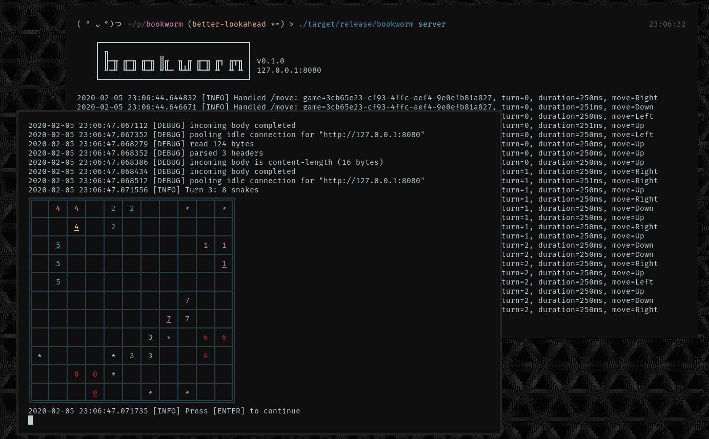

# Bookworm 🐛

Bookworm is a [BattleSnake][1] bot written in [Rust][2] for the March 2020 tournament. Combines the strategies of pruned turn tree exploration, minimax, and heuristic scoring. The snake is given a time budget to explore the turn tree; the fewer the snakes, the deeper the exploration.

_A server instance playing against itself using the built-in host mode. See `play-host.sh` as an example._

## Building and running

Just run `cargo build --release` to produce a self-contained binary at `target/release/bookworm`. The binary can be invoked with a number of modes and options, which the `-h` flag explains in detail. The available modes are:

* **server:** Runs as a typical snake API server, ready to be play.
* **host:** Locally hosts a match between given snakes, logging each turn state. Implements 2020 rules.
* **benchmark:** A series of common operations are timed and logged.

## Development

Unit tests can be run with `cargo test`, though some strategy tests will fail currently. To quickly build and run the bot, use `cargo run <mode>`. Note that the development build is significantly slower at runtime than the release build, so you may need to increase the `--timeout` for host mode and give the server more time budget with `--budget` to achieve similar lookahead depths.

### Todos and improvement ideas:
* Heuristics and strategy
  * Implement more unit tests for behaviour
  * Seed the turn tree exploration with some longer term "plays" instead of just single space movements
  * Allow for chances of death instead of assumed worst case
  * If death unavoidable, prefer head-to-head
  * Are there heuristic elements we can skip sometimes?
* Performance
  * Can I write some `const fn` to move work to compile time?
  * Can I use fixed arrays or `vec![0.0; src.len()]` anywhere?
  * Look for places to use `.copied()` instead of `.cloned()`
  * Avoid indexing into vecs; use `if let Some(x) = vec.get(i)`
  * [infallible DS][3] to avoid empty checks
  * Move hosting to `us-west-1` to be closer to BS host
* Pathfinding (if used)
  * JPS
  * Dynamic heuristic weight

### The "wat" list

Questionable life choices:

* [Turn 114: Feeding rule change?](https://play.battlesnake.com/g/72eee8c6-7b26-4b81-afb0-1afa17f5c5bf/)
* [Turn 230: Gave enemy opportunity to easily kill us head-to-head](https://play.battlesnake.com/g/04c853c2-0e3e-4013-8bb5-fd66a82ce2d6/)
* [Turn 383: Gave enemy opportunity to easily trap us](https://play.battlesnake.com/g/c196792b-7a8c-4ccf-b63d-d89da1fdba6b/)
* [Turn 300: Trapped self... why??](https://play.battlesnake.com/g/880a59ac-3fe9-4204-a37c-6cbf796f5030/)
* [Turn 36: Giving up too early](https://play.battlesnake.com/g/a1646958-edda-4000-9fde-a926292ba1d0/)
* [Turn 13: Allow for chance of survival](https://play.battlesnake.com/g/53b159ea-a914-493d-8c73-54680186fafa/)
* [Turn 21: Prefer going up because less likely blue_bottle will go there](https://play.battlesnake.com/g/eff9c73e-cbb2-4bf9-98a1-89f0e8244bcb/)
* [Turn 74: Ran into another snake, but should prefer possibility of head-to-head death](https://play.battlesnake.com/g/977be8a8-ca65-48b8-bc8c-37310ab61701/)

## References and resources

* https://github.com/BattlesnakeOfficial/rules/blob/master/standard.go
* https://github.com/BattlesnakeOfficial/engine/blob/master/rules/tick.go
* https://github.com/anvaka/ngraph.path
* https://github.com/riscy/a_star_on_grids
* https://www.redblobgames.com/pathfinding/grids/algorithms.html
* [http://likebike.com/posts/How_To_Write_Fast_Rust_Code.html][3]

[1]: https://play.battlesnake.com/
[2]: https://www.rust-lang.org/
[3]: http://likebike.com/posts/How_To_Write_Fast_Rust_Code.html
